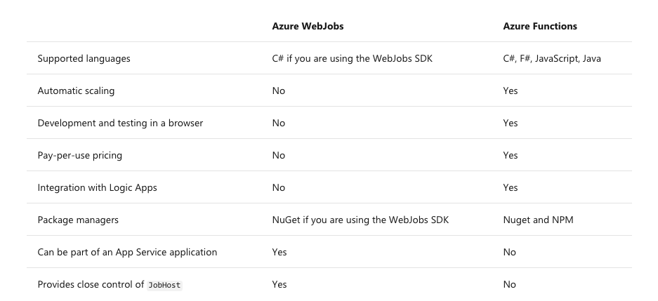
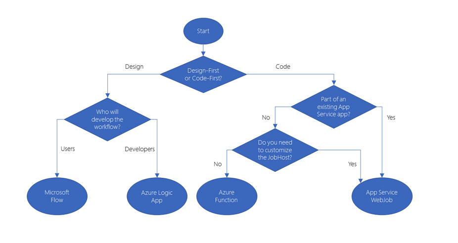
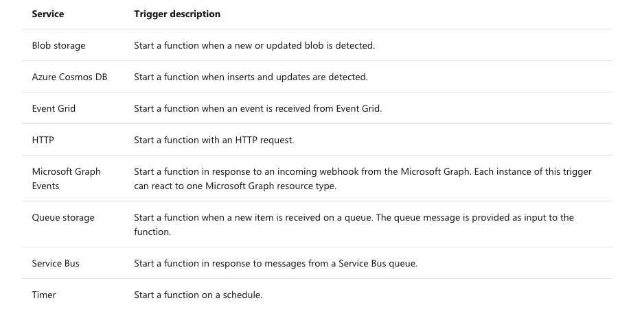

# Create Serverless Applications

## Choose the best Azure service to automate your business processes

- Modeling workflows in Azure
  - *Logic Apps*: design-first web flows, ability to alter code
  - *Microsoft Flow*: built on tob of Logic apps for non dev/IT professionals, no access to code
  - *WebJobs*
    - Code-first solution
    - Used by web apps etc to run a program/script automatically (Continuous or Triggered)
  - *Azure Functions*
    - Code-first solution
    - Run small pieces of code without managing infrastructure
    - Pay as you go
    

- Choosing a solution

[Exercise: Logic Apps](https://docs.microsoft.com/en-us/learn/modules/choose-azure-service-to-integrate-and-automate-business-processes/4-logic-apps-and-flow)

[Exercise: Functions](https://docs.microsoft.com/en-us/learn/modules/choose-azure-service-to-integrate-and-automate-business-processes/5-web-jobs-and-functions)

## Create serverless logic with Azure Functions

- Azure Functions: Benefits
  - Avoids over-allocation of infrastructure
  - Stateless logic
  - Event driven
  - Functions can be used in traditional compute environments
- Drawbacks
  - Execution time: if function requires more than 10 minutes, needs to be hosted on VM; HTTTP requests that expect HTTP responses are restricted to 2.5 minutes
    - *Durable Functions* allow you to orchestrate execution of multiple functions without timeouts
  - Execution frequency: continuous execution might by cheaper on a VM

## Create a function app in the Azure portal

[Exercise](https://docs.microsoft.com/en-us/learn/modules/create-serverless-logic-with-azure-functions/3-create-an-azure-functions-app-in-the-azure-portal?pivots=javascript)

- Service plans
  - *Consumption Service Plan*: automatic scaling and bills only when functions are running
  - *Azure App Service Plan*: billed for resources functions run on
- *Must* be linked to storage account

- Supported Triggers

- *Bindings*
  - declarative way to connect data and services to function
  - Trigger is special type of input binding
  - [Bindings](https://docs.microsoft.com/azure/azure-functions/functions-triggers-bindings#supported-bindings)

## Execute an Azure Function with triggers

- Timer Trigger
  - Requires
    - *Timestamp parameter name*
    - *CRON expression*

- HTTP Trigger
  - Authorization level
    - Function: key based (function or host [function app] key)
    - Anonymous
    - Admin: key based (host key required)

## Chain Azure Functions together using input and output bindings

[Summary](https://docs.microsoft.com/en-us/learn/modules/chain-azure-functions-data-using-bindings/8-summary)

- *Binding properties*
  - Required
    - *Name*: parameter through which the you access the data
    - *Type*: type of data/service
    - *Direction*: input/output
  - Optional
    - *Connection*: most binding types require key that has connection string