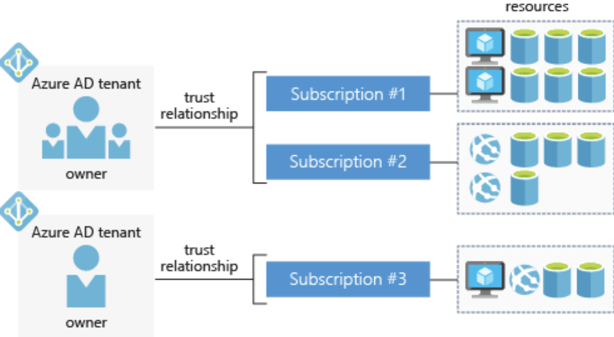

- What is cloud computing?
    - Services: compute power, storage, networking, analytics
        - Compute Approaches

- Benefits of cloud
    - Scaling
        - Vertical: adding resources to increase power
        - Horizontal: adding more servers to function together as unit

- [Compliance](https://docs.microsoft.com/en-us/learn/modules/principles-cloud-computing/3a-compliance)
    - Criminal Justice Information Servicwes (CJIS): Azure only cloud contractually committed to
    - Cloud Security Alliance (CSA) STAR Certification
    - EU Model Clauses: provides contractual guarantees around data transfers; first company to receive joint approval that meets EU standards
    - HIPAA: agreement offered
    -ISO/IEC: first cloud provider to adopt 2018 code of practice

- Capital expenditure vs. operational expenditure
    - CapEx: paying upfront
    - OpEx: Pay as uses it
    - OpEx enables flexibility as demand fluctuates

- Cloud Deployment Models
    - Public
    - Private
    - Hybrid
    - [Cloud Deployment Models](https://docs.microsoft.com/en-us/learn/modules/principles-cloud-computing/4-cloud-deployment-models)
- Types of Cloud Services
    - IaaS
    - PaaS
    - SaaS

- [Azure Services](https://docs.microsoft.com/en-us/learn/modules/welcome-to-azure/3-tour-of-azure-services)

# Architecture and Service Guarantees
- [Architecture and Service Guarantees](https://docs.microsoft.com/en-us/learn/modules/explore-azure-infrastructure/index)
- [Summary](https://docs.microsoft.com/en-us/learn/modules/explore-azure-infrastructure/9-summary)
- Global Azure Services: Microsoft Azure Active Directory, Microsoft Azure Traffic Manager, Azure DNS
- Special regions
    - US DoD Central, US Gov Virginia, US Gov Iowa etc. 
        - For government agencies
    - China East, China North
        - Not directly maintained by Microsoft
- Geographies
    - Defined by geopolitical boundaries or country borders (data residency, sovereignty and compliance honored)
    - Fault tolerant; can withstand complete region failure
- Availability Zones
    - 1+ Physically separate datacenter within Azure region
    - Min three withing region
    - _Isolation Boundaries_
    
    - Not all regions support
    - *Primarily for* VMs, managed disks, load balancers, and SQL databases
        - *Zonal services*: resource pinned to zone
        - *Zone-redunant services*: platform replicates across zones
- Region pairs
    - At least 300 miles away
    - Geographical replication

- Service-level Agreements
    - *Performance Targets*
    - *Uptime and Connectivity Guarantees*
    

    - *Service Credits*
- Composite SLA
    - Combined probability of failure
- Application SLA
    - Set performance targets to suit specific Azure application
    - Resiliency
        - Ability to recover from failure
        - *Failure Mode Analysis*: process to identify points of failure and needed response
    - Availability

# Azure Account Overview
- [Summary](https://docs.microsoft.com/en-us/learn/modules/create-an-azure-account/7-summary)
- *Account*: identity in either Azure Active Directory or one trusted by Azure AD
- *Subscription*: logical container to provision resources; each is associated with Azure AD
    - Types
        - Free
        - Pay-As-You-Go
        - Enterprise
        - Student
    
    - Single bill generated for each subscription monthly
- Transferring Subscriptions between Accounts
    - "If you transfer a subscription to a new Azure AD tenant, all role assignments in RBAC will be permanently deleted from the source tenant and not migrated to the target tenant."
- Authenticate Access with Azure AD
    - *Tenant*: dedicated, isolated instance of Azure AD ownee and managed by an organization (org could be individuals, teams, companies etc)
     - Tenants and subscriptions o have *one-to-many* relationship
     
- [Support Options](https://docs.microsoft.com/en-us/learn/modules/create-an-azure-account/6-support-options)

# Manage Services with the Azure portal
- [Summary](https://docs.microsoft.com/en-us/learn/modules/tour-azure-portal/9-summary)
- Options
    - *Azure portal*
    - *Azure PowerShell/CLI*
    - *Azure Cloud Shell*
        - Persistent environment
    - *Azure mobile app*

# Azure Compute Options
- [Summary](https://docs.microsoft.com/en-us/learn/modules/intro-to-azure-compute/7-summary)
- Common techniques
    - *VMs*
    - *Containers*
    - *Azure App Service*: platform-as-a-service (PaaS) offering that is designed to host enterprise-grade web-oriented applications
    - *Serverless*s
- Virtual Machines
    - Scaling
        - *Availability sets*
            - Logical grouping of 2+ VMs
            - Keeps available for planned or unplanned maintenance 
            
        - *Virtual Machine Scale Sets*
            - Group of identical, load balanced VMs
        - *Azure Batch*
            - Enables large-scaled job scheduling and compugted managements with a pool of VMs
            
- Containers
    - Azure Container Instances (ACI)
    - Azure Kubernetes Service (AKS)
- Azure App Service
    - Host without managing infrastructure
    - Common styles:
        - Web Apps
        - API Apps
        - WebJobs
        - Mobile Apps
- Serverless
    - *Abstraction of servers*
    - *Event-driven scale*
    - *Micro-billing*
    Implementations
        - Azure Functions
        - Azure Logic Apps (codeless; designed in web-based designer)

# Data Storage
