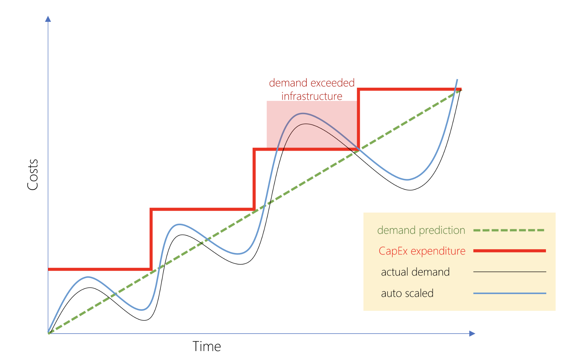

# Azure Fundamentals

## General Intro To Azure Services

*NB*: Unless otherwise indicated, all service names can be prefaced with "Azure" e.g. Queue Storage is "Azure Queue Storage"

- What is cloud computing?
  - Services: compute power, storage, networking, analytics
    - Compute Approaches

- Benefits of cloud
  - Scaling
    - Vertical: adding resources to increase power
    - Horizontal: adding more servers to function together as unit

- [Compliance](https://docs.microsoft.com/en-us/learn/modules/principles-cloud-computing/3a-compliance)
  - Criminal Justice Information Services (CJIS): Azure only cloud contractually committed to
  - Cloud Security Alliance (CSA) STAR Certification
  - EU Model Clauses: provides contractual guarantees around data transfers; first company to receive joint approval that meets EU standards
  - HIPAA: agreement offered
  -ISO/IEC: first cloud provider to adopt 2018 code of practice

- Capital expenditure vs. operational expenditure
  - CapEx: paying upfront
  - OpEx: Pay as uses it
  - OpEx enables flexibility as demand fluctuates

- Cloud Deployment Models
  - Public
  - Private
  - Hybrid
  - [Cloud Deployment Models](https://docs.microsoft.com/en-us/learn/modules/principles-cloud-computing/4-cloud-deployment-models)
- Types of Cloud Services
  - IaaS
  - PaaS
  - SaaS

- [Azure Services](https://docs.microsoft.com/en-us/learn/modules/welcome-to-azure/3-tour-of-azure-services)

## Architecture and Service Guarantees

- [Architecture and Service Guarantees](https://docs.microsoft.com/en-us/learn/modules/explore-azure-infrastructure/index)
- [Summary](https://docs.microsoft.com/en-us/learn/modules/explore-azure-infrastructure/9-summary)
- Global Azure Services: Microsoft Azure Active Directory, Microsoft Azure Traffic Manager, Azure DNS
- Special regions
  - US DoD Central, US Gov Virginia, US Gov Iowa etc.
    - For government agencies
  - China East, China North
    - Not directly maintained by Microsoft
- Geographies
  - Defined by geopolitical boundaries or country borders (data residency, sovereignty and compliance honored)
  - Fault tolerant; can withstand complete region failure
- Availability Zones
  - 1+ Physically separate data center within Azure region
  - Min three withing region
  - _Isolation Boundaries_

  

  - Not all regions support
  - *Primarily for* VMs, managed disks, load balancers, and SQL databases
    - *Zonal services*: resource pinned to zone
    - *Zone-redundant services*: platform replicates across zones
- Region pairs
  - At least 300 miles away
  - Geographical replication

- Service-level Agreements
  - *Performance Targets*
  - *Uptime and Connectivity Guarantees*

  

  - *Service Credits*
- Composite SLA
  - Combined probability of failure
- Application SLA
  - Set performance targets to suit specific Azure application
  - Resiliency
    - Ability to recover from failure
    - *Failure Mode Analysis*: process to identify points of failure and needed response
  - Availability

## Azure Account Overview

- [Summary](https://docs.microsoft.com/en-us/learn/modules/create-an-azure-account/7-summary)
- *Account*: identity in either Azure Active Directory or one trusted by Azure AD
- *Subscription*: logical container to provision resources; each is associated with Azure AD
  - Types
    - Free
    - Pay-As-You-Go
    - Enterprise
    - Student

  

  - Single bill generated for each subscription monthly
- Transferring Subscriptions between Accounts
  - "If you transfer a subscription to a new Azure AD tenant, all role assignments in RBAC will be permanently deleted from the source tenant and not migrated to the target tenant."
- Authenticate Access with Azure AD
  - *Tenant*: dedicated, isolated instance of Azure AD owner and managed by an organization (org could be individuals, teams, companies etc)
    - Tenants and subscriptions o have *one-to-many* relationship

    

- [Support Options](https://docs.microsoft.com/en-us/learn/modules/create-an-azure-account/6-support-options)

## Manage Services with the Azure portal

- [Summary](https://docs.microsoft.com/en-us/learn/modules/tour-azure-portal/9-summary)
- Options
  - *Azure portal*
  - *Azure PowerShell/CLI*
  - *Azure Cloud Shell*
    - Persistent environment
  - *Azure mobile app*

## Azure Compute Options

- [Summary](https://docs.microsoft.com/en-us/learn/modules/intro-to-azure-compute/7-summary)
- Common techniques
  - *VMs*
  - *Containers*
  - *Azure App Service*: platform-as-a-service (PaaS) offering that is designed to host enterprise-grade web-oriented applications
  - *Serverless*s
- Virtual Machines
  - Scaling
    - *Availability sets*
      - Logical grouping of 2+ VMs
      - Keeps available for planned or unplanned maintenance

      
    - *Virtual Machine Scale Sets*
          - Group of identical, load balanced VMs
    - *Azure Batch*
          - Enables large-scaled job scheduling and compute management with a pool of VMs

        

- Containers
  - Azure Container Instances (ACI)
  - Azure Kubernetes Service (AKS)
- Azure App Service
  - Host without managing infrastructure
  - Common styles:
    - Web Apps
    - API Apps
    - WebJobs
    - Mobile Apps
- Serverless
  - *Abstraction of servers*
  - *Event-driven scale*
  - *Micro-billing*
  Implementations
    - Azure Functions
    - Azure Logic Apps (codeless; designed in web-based designer)

## Data Storage

- [Summary](https://docs.microsoft.com/en-us/learn/modules/intro-to-data-in-azure/6-summary)
- Services
  - *SQL Database*: relational database as a service
  - *Cosmos DB*: schema-less
  - *Blob storage*: unstructured i.e. no restrictions on type of data
  - *Data Lake Storage*: "combines the scalability and cost benefits of object storage with the reliability and performance of the Big Data file system capabilities"

  

  - *Files*: file shares accessible via Server Message Block (SMB) protocol
  - *Queue Storage*: can store large number of messages for asynchronous message queuing
  - *Disk Storage*
- Tiers
  - *Hot*: frequent
  - *Cool*: infrequent (stored for at least 30 days)
  - *Archive*: rarely (stored for at least 180 days; flexible latency requirements)
- Encryption
  - Storage Service Encryption - data at rest
  - Client-side encryption: Azure stores previously encrypted data at rest; decrypted during retrieval
- [On Prem vs Cloud Storage](https://docs.microsoft.com/en-us/learn/modules/intro-to-data-in-azure/4-comparison-azure-and-on-prem-storage)

  

## Networking Options

- *Azure Region*: one or more data centers within a specific geographical location
- *Virtual Network*: logically isolated network; can be segmented into sub-nets
- *Network Security Group*: allows/denies inbound network traffic
- *Load Balancer*
- *Application Gateway: load balancer designed for web applications i.e. all your traffic is HTTP
  - Uses Load Balancer at the TCP level
  
  - Content Delivery Network (CDN): distributed network of servers that can efficiently deliver web content to users
- *DNS*: you can bring your own sever or use Azure DNS
- *Azure Traffic Manager*
  - How does one deal with latency for geographically remote users?
  - Scale out with exact copies
  - Traffic Manager
    - Traffic Manager uses closest DNS server
    - Can also connect to on-prem deployments
    - *Load Balancer* vs *Traffic Manager*
      - Load balancer distributes traffic *within same region*
      - Traffic managers works at DNS level *directs client to preferred endpoint*
      - Load balancers are intra-region, Traffic managers are inter-region

## Security, responsibility, and trust in Azure

- [Shared Responsibility](https://docs.microsoft.com/en-us/learn/modules/intro-to-security-in-azure/2-shared-responsibility)

  
- Defense in depth

  

